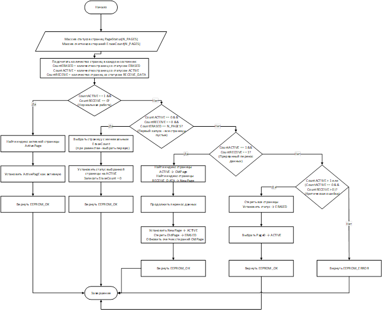
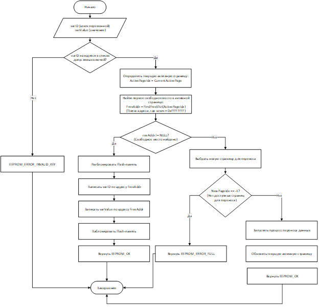
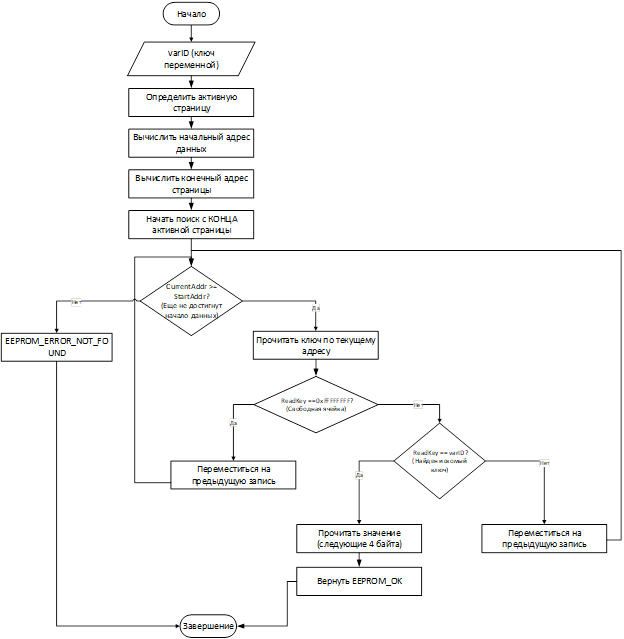
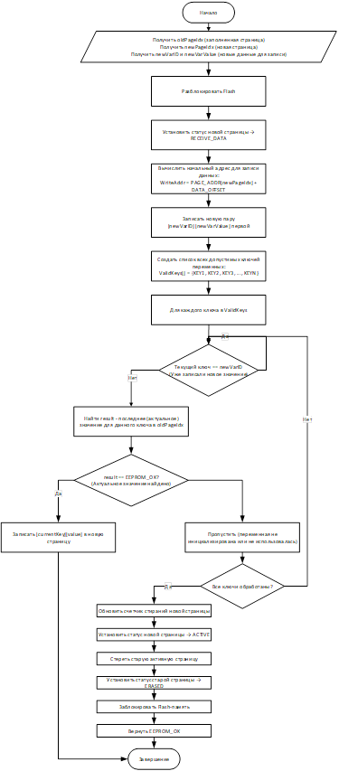
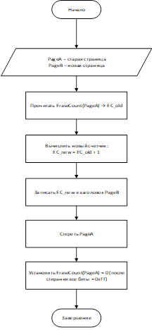
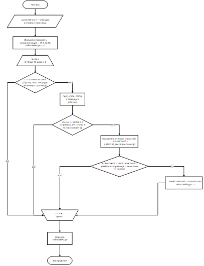
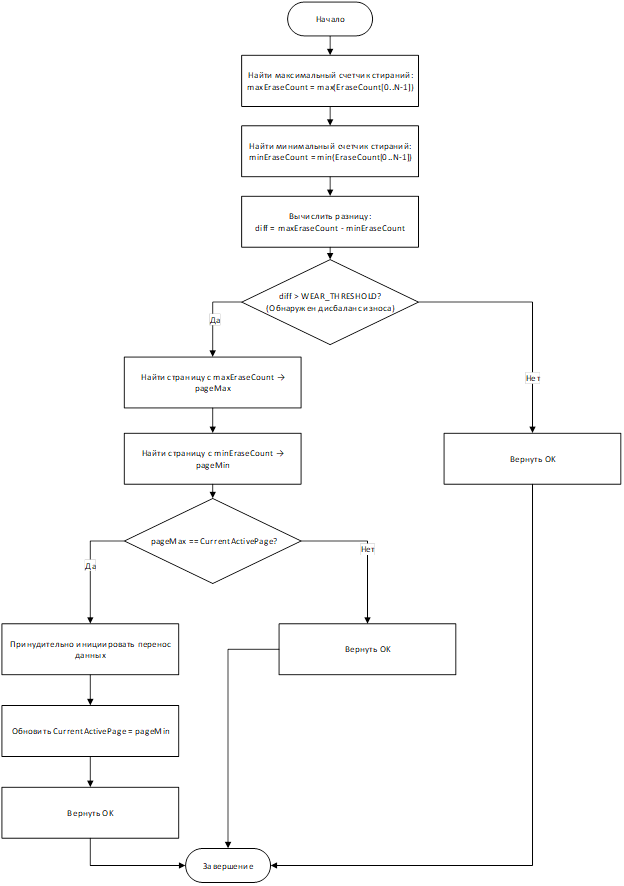
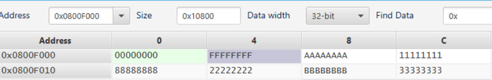

# ВВЕДЕНИЕ

## Актуальность темы

         Для многих электронных устройств необходима энергонезависимая память, которая сохраняет значение ячеек памяти при выключении питания. Примером такого рода устройств являются встраиваемые системы, как, например, STM32F103C8T6. Они имеют встроенную Flash–память, в которой есть ограничения циклов перезаписи – около 10 000, что является существенным недостатком в контексте динамически изменяющихся и перезаписывающихся данных. Для такого вида использования гораздо эффективнее применять решения с большим запасом циклов перезаписи.

         Решением данной проблемы может стать использование EEPROM–памяти, которая имеет до 1 000 000 циклов перезаписи за счёт иной архитектуры. Микроконтроллеры серии STM32F1X не содержат встроенной EEPROM–памяти для хранения энергонезависимых данных.  Следовательно, это влечёт за собой использование внешней микросхемы, которая подключается отдельно к микроконтроллеру, занимает дополнительное место и добавляет стоимость к конечному изделию или решению.

         Чтобы избежать всех перечисленных проблем эффективнее разработать программную эмуляцию EEPROM на основе встроенной Flash–память, используя алгоритмы, которые искусственно увеличат количество циклов перезаписи. А также готовое решение можно будет использовать на широком спектре устройств, в которых присутствует Flash–память и отсутствует EEPROM.

## Цель

         Разработать, реализовать и документально описать программный драйвер для эмуляции EEPROM на базе встроенной Flash-памяти целевой платформы STM32F103C8T6.

## Задачи

**·**        **Подробно изучить и описать архитектуру и устройство Flash-памяти STM32F103C8T6;**

**·**        **Разработать алгоритмы записи, чтения и управления памятью для эмуляции EEPROM;**

**·**        **Реализовать алгоритм выравнивания износа (Wear Leveling);**

**·**        **Написать драйвер EEPROM на базе STM32CubeIDE;**

**·**        **Проверить корректность и надежность системы посредством комплексного тестирования.**

  

# 1 АРХИТЕКТУРА FLASH-ПАМЯТИ МИКРОКОНТРОЛЛЕРА STM32F103C8T6

## **1.1 Общие сведения о микроконтроллере STM32F103C8T6**

         Микроконтроллер STM32F103C8T6 относится к семейству STM32F1 компании _STMicroelectronics_. Он сочетает в себе низкое энергопотребление и высокую производительность, что делает его широко применимым в системах управления, измерениях, промышленной автоматике и встраиваемых устройствах.

         Основные характеристики микроконтроллера:

·        Тактовая частота ядра – до **72 МГц**;

·        Объём флэш–памяти программ – **64 КБ**;

·        Оперативная память (SRAM) – **20 КБ**;

·        Интерфейсы: USART, SPI, I²C, CAN, USB, ADC и др.;

·        Напряжение питания – **2,0–3,6 В**;

·        Встроенная флэш–память используется как для хранения кода программы, так и для энергонезависимых данных.

         Дальнейшие разделы рассматривают особенности внутренней флэш–памяти, поскольку именно она используется для реализации программной эмуляции EEPROM.

## **1.2 Структура и организация Flash-памяти**

         Встроенная флэш–память микроконтроллера STM32F103C8T6 имеет организацию, основанную на страничном принципе. Память разбита на страницы, каждая из которых является минимальной единицей стирания.

**_Таблица 1_** _–_ **_Основные параметры Flash-памяти STM32F103C8T6_**

|   |   |
|---|---|
|Параметр|Значение|
|Общий объём памяти|64 КБ|
|Размер одной страницы|1 КБ|
|Количество страниц|64|
|Адрес начала памяти|0x0800 0000|
|Адрес конца памяти|0x0800 FFFF|
|Минимальное количество циклов стирания/записи|10 000|

         Каждая страница памяти имеет собственный базовый адрес. Страницы нумеруются от 0 до 63.

**_Таблица 2_** _–_ **_Пример адресного пространства Flash-памяти_**

|   |   |   |   |
|---|---|---|---|
|№ страницы|Адрес начала|Адрес конца|Размер|
|Page 0|0x0800 0000|0x0800 03FF|1 КБ|
|Page 1|0x0800 0400|0x0800 07FF|1 КБ|
|Page 2|0x0800 0800|0x0800 0BFF|1 КБ|
|…|…|…|…|
|Page 62|0x0800 F800|0x0800 FBFF|1 КБ|
|Page 63|0x0800 FC00|0x0800 FFFF|1 КБ|

         Для хранения пользовательских энергонезависимых данных (эмуляции EEPROM) **рекомендуется использовать последние страницы памяти** (например, 62 и 63). Это позволяет избежать конфликтов с основной программой, размещаемой в начальных секторах памяти.

## **1.3 Особенности работы с Flash–памятью**

         Флэш–память микроконтроллеров STM32 имеет ряд ограничений, которые необходимо учитывать при разработке алгоритмов записи и хранения данных:

·        Необходимость стирания перед записью. Перед записью новых данных страница должна быть полностью очищена, то есть все биты установлены в значение 0xFF;

·        Минимальная единица стирания – страница (1 КБ). Невозможно стереть отдельные байты или слова;

·        Задержка при операциях. Процедура стирания страницы занимает до 40 мс, в течение которых процессор приостанавливает выполнение программы;

·        Ограниченный ресурс. Каждая страница выдерживает около 10 000 циклов перезаписи. После этого возможно ухудшение параметров или потеря данных;

·        Запись выполняется полусловами (16 бит) или словами (32 бит) в зависимости от настроек интерфейса.

         Эти ограничения делают прямое использование Flash-памяти как EEPROM нецелесообразным без специальных алгоритмов. В частности при необходимости часто обновлять отдельные переменные постоянное стирание страницы приведёт к быстрому исчерпанию ресурса памяти.

# 2 ПРИНЦИПЫ АЛГОРИТМА ЭМУЛЯЦИИ EEPROM

## **2.1** Понятие EEPROM

         EEPROM (Electrically Erasable Programmable Read–Only Memory) представляет собой энергонезависимую память с возможностью многократных индивидуальных изменений байтов.

         Основные отличия Flash и EEPROM с точки зрения хранения данных представлены в таблице 3:

**_Таблица 3_** _– **Сравнение свойств внешней EEPROM  и Flash-памяти**_

|   |   |   |
|---|---|---|
|Параметр|Внешняя EEPROM|Flash–память|
|Минимальная единица записи|1 байт|2–4 байта|
|Минимальная единица стирания|1 байт|1 страница (1 КБ)|
|Среднее время записи|5 мс на байт|30 мкс – 200 мс на полуслово|
|Ресурс циклов записи|1 000 000|10 000 на одну страницу|
|Энергозависимость|Энергонезависимая|Энергонезависимая|
|Возможность случайной записи байта|Да|Нет (только страница целиком)|
|Стоимость реализации|Требует отдельного чипа|Используется встроенная память|

         Из таблицы видно, что Flash–память имеет меньший ресурс записи, но позволяет сократить количество компонентов и себестоимость конечного изделия. Для компенсации низкого ресурса используется **программная эмуляция EEPROM**, реализуемая на уровне прошивки микроконтроллера.

         Программное обеспечение, выполняющее сохранение данных во встроенной Flash-памяти и копирующее механизм работы EEPROM, будем называть драйвером для программной эмуляции EEPROM.

## 2.2 Основная концепция

         Алгоритм эмуляции EEPROM использует систему ключ-значение и многостраничную архитектуру для увеличения количества циклов перезаписи.​

         Ключевые принципы:

·        Использование двух и более страниц Flash-памяти для распределения циклов стирания между ними;

·        Последовательная запись данных без немедленного стирания страницы;

·        Идентификация переменных через ключи;

·        Перенос на новую страницу только актуальных данных при заполнении активной страницы.

## 2.3 Формат хранения данных

         Каждая переменная хранится в виде пары ключ-значение:

|   |   |
|---|---|
|Ключ (ID)  4 байта|Значение (Data)  4 байта|

         Пример хранения переменных в памяти приведён в таблице 4:

**_Таблица 4_** _– **Пример хранения переменных в памяти**_

|   |   |   |
|---|---|---|
|Переменная|Ключ (ID)|Значение|
|data_1|0x11111111|0x00001010|
|data_2|0x22222222|0x00002020|
|data_3|0x33333333|0x00003030|

         При обновлении значения существующей переменной data_2 новая пара ключ-значение записывается в следующее свободное место страницы:​

**_Таблица 5_** _– **Пример хранения переменных в памяти после новой записи**_

|   |   |   |
|---|---|---|
|Переменная|Ключ (ID)|Значение|
|data_1|0x11111111|0x00001010|
|data_2|0x22222222|0x00002020|
|data_3|0x33333333|0x00003030|
|data_2|0x22222222|0x00004567|

         Здесь для переменной data_2 существует два значения: старое 0x00002020 и актуальное 0x00004567. При чтении/перезаписи используется последнее (актуальное) значение.

## 2.4 Статусы страниц

         Статус страницы обычно занимает 4 байта, потому что минимальная адресуемая единица записи во Flash STM32 – это слово размером 32 бита. Следовательно, каждая страница имеет заголовок (первые 4 байта), определяющий её состояние. В документе application note от STMicroelectronics для реализации EEPROM  рекомендуется использовать следующие статусы страниц:

**_Таблица 6_** _– **Статусы страниц памяти**_

|   |   |   |
|---|---|---|
|Статус|Значение|Описание|
|ERASED|0xFFFFFFFF|Страница очищена и готова к записи|
|ACTIVE|0x00000000|Страница активна и используется для записи|
|RECEIVING_DATA|0x55555555|Страница в процессе копирования данных|

         Жизненный цикл страниц:

         ERASED → RECEIVING_DATA → ACTIVE → ERASED.

## 2.5 Механизм переноса данных (Page Transfer)

         Когда активная страница заполняется, запускается процесс переноса данных (Page Transfer):​

1.     Вторая страница переводится в статус RECEIVING_DATA;

2.     Для каждого уникального ключа из первой страницы находится последнее (актуальное) значение;

3.     Актуальные данные копируются во вторую страницу;

4.     После успешного копирования вторая страница получает статус ACTIVE;

5.     Первая страница стирается и переводится в статус ERASED.

Преимущества этого подхода:

·        Страница стирается только при полном заполнении, а не при каждом обновлении переменной;

·        При сбое питания данные не теряются – они остаются в первой странице;

·        Циклы стирания распределяются между двумя страницами.

  

# 3 ДЕТАЛЬНОЕ ОПИСАНИЕ АЛГОРИТМОВ

## 3.1 Алгоритм инициализации (EEPROM_Init)

         Назначение: определение текущего состояния всех N страниц памяти, выбор активной страницы, восстановление системы после сбоя питания, инициализация счетчиков стираний для wear leveling.

Блок–схема процесса инициализации изображена на рисунке 1:

_Рисунок 1 – Блок–схема процесса инициализации_

Входные данные:

·        Количество страниц: N_PAGES (например, 2, 3 или 4)

·        Адреса всех страниц: PAGE_ADDR[0..N–1]

Выходные данные:

·        Индекс активной страницы

·        Статус инициализации: EEPROM_OK или EEPROM_ERROR

Описание логики:

1.     Нормальная работа: ровно одна страница имеет статус ACTIVE, остальные – ERASED. Система продолжает работу с активной страницей.

2.     Первый запуск: все страницы в состоянии ERASED. Выбирается страница с минимальным счетчиком стираний (обычно все равны 0, выбирается первая), устанавливается статус ACTIVE.

3.     Восстановление после сбоя: обнаружена комбинация ACTIVE + RECEIVE_DATA. Это означает, что перенос данных был прерван. Система завершает копирование данных из ACTIVE в RECEIVE_DATA, затем новая страница становится активной, старая стирается.

4.     Критическая ошибка: несколько страниц одновременно имеют статус ACTIVE, или нет активной при наличии RECEIVE_DATA. Выполняется полное форматирование всех страниц.

5.     Wear Leveling при инициализации: при выборе новой активной страницы учитывается счетчик стираний каждой страницы – выбирается страница с минимальным износом.

## 3.2 Алгоритм записи переменной (EEPROM_Write)

         Назначение: запись или обновление значения переменной по её ключу (Virtual Address) с автоматическим переносом данных при заполнении страницы и выбором оптимальной страницы для wear leveling.

Входные данные:

·        varID – виртуальный адрес (ключ) переменной (4 байта)

·        varValue – значение переменной (4 байта)

Выходные данные:

·        EEPROM_OK – успешная запись

·        EEPROM_ERROR – ошибка (недопустимый ключ, переполнение)

Блок–схема процесса записи изображена на рисунке 2:

_Рисунок 2 – Блок–схема процесса записи переменной_

Описание логики:

1.     Проверяется, допустим ли ключ переменной (есть ли он в списке разрешённых).

2.     В активной странице ищется свободное место для записи.

3.     Если оно найдется, туда записывается пара ключ-значение.

4.     Если страница переполнена, по алгоритму wear leveling выбирается новая страница с минимальным износом, происходит перенос всех актуальных значений, новая становится ACTIVE.

## 3.3 Алгоритм чтения переменной (EEPROM_Read)

         Назначение: чтение актуального значения переменной по её ключу из активной страницы.

Входные данные:

·        varID – виртуальный адрес переменной.

Выходные данные:

·        varValue – значение переменной (через указатель)

·        EEPROM_OK – успешное чтение

·        EEPROM_ERROR_NOT_FOUND – переменная не найдена

         Блок–схема процесса чтения изображена на рисунке 2:

_Рисунок 3 – Блок–схема процесса чтения переменной_

Описание логики:

1.     Поиск значения переменной начинается с конца активной страницы (т.к. последнее записанное значение является актуальным).

2.     Последовательно перебираются записи, пока не найден запрошенный ключ.

3.     Если запись найдена, значение возвращается; если нет – происходит возврат ошибки.

## 3.4 Алгоритм смены страницы (EEPROM_PageTransfer) с N страницами

         Назначение: перенос актуальных данных из заполненной активной страницы в новую выбранную страницу с последующим стиранием старой страницы. Выбор новой страницы производится с учетом wear leveling (минимальный счетчик стираний).

Входные данные:

·        oldPageIdx – индекс текущей активной (заполненной) страницы

·        newPageIdx – индекс новой страницы для переноса

·        newVarID – ключ новой переменной для записи

·        newVarValue – значение новой переменной

Выходные данные:

·        EEPROM_OK – успешный перенос

·        EEPROM_ERROR – ошибка переноса

Защита от сбоя питания:

·        Новая страница получает статус RECEIVE_DATA до начала копирования данных;

·        Старая страница остаётся в статусе ACTIVE до полного завершения копирования;

·        Если питание прервётся во время копирования, при следующей инициализации система обнаружит комбинацию RECEIVE_DATA + ACTIVE и автоматически продолжит процесс переноса;

·        Данные не теряются, так как старая страница сохраняет всю информацию до момента успешного завершения переноса.

Блок–схема процесса переноса:

_Рисунок 4 – Блок–схема процесса_ _смены страницы_

Описание логики:

1.     Новая страница получает RECEIVE_DATA;

2.     Записывается новая переменная первой;

3.     Переносятся все актуальные значения;

4.     Обновляется счетчик стираний;

5.     Новая страница становится активной – старая ERASED.  
  

  

# 4 АЛГОРИТМ ВЫРАВНИВАНИЯ ИЗНОСА (WEAR LEVELING) ДЛЯ N СТРАНИЦ

## 4.1 Принцип работы Wear Leveling с множеством страниц

         Цель: равномерное распределение циклов стирания между всеми N страницами Flash-памяти для максимального увеличения срока службы системы.

Типы Wear Leveling:

Динамическое (Dynamic Wear Leveling):

·        Применяется автоматически при базовой работе алгоритма с N страницами.

·        При переносе данных выбирается страница с минимальным счетчиком стираний.

·        Обеспечивает равномерность при регулярном обновлении данных.

Статическое (Static Wear Leveling):

·        Принудительный перенос данных даже при отсутствии заполнения страницы.

·        Активируется при превышении порогового значения разницы счетчиков стираний между страницами.

·        Перемещает даже редко изменяемые данные для выравнивания износа.

## 4.2 Структура заголовка страницы с учётом счётчика стираний

         Каждая страница имеет расширенный заголовок размером 8 байт, которые располагаются в начале, как показано в таблице 7:

**_Таблица 7_** _– **Пример страницы памяти**_  

|   |   |   |   |
|---|---|---|---|
|Смещение|Размер, Байт|Название|Описание|
|0x…00|4|Status|Статус страницы (ERASED/ACTIVE/RECEIVE_DATA)|
|0x…04|4|EraseCount|Счётчик циклов стирания страницы|
|0x…08|…|Data|Пользовательские данные (пары ключ-значение)|

## 4.3 Алгоритм обновления счётчика стираний

         При каждом переносе данных счетчик стираний увеличивается на единицу.

_Рисунок 5 – Блок–схема процесса_ _работы счётчика стираний_

## 4.4 Динамическое выравнивание износа (Dynamic Wear Leveling)

         Принцип: при выборе новой страницы для переноса данных всегда выбирается страница с минимальным счетчиком стираний среди доступных (очищенных) страниц.

Описание алгоритма:

1.     Анализируются все страницы, кроме текущей активной.

2.     Выбирается страница, у которой минимальный счетчик стираний (EraseCount).

3.     Если подходящей страницы нет – возвращается ошибка.

Блок–схема алгоритм выбора страницы:

_Рисунок 6 – Блок–схема алгоритма выбора страницы_

## 4.5 Статическое выравнивание износа (Static Wear Leveling)

         Назначение: принудительное перемещение данных между страницами даже при отсутствии заполнения активной страницы, если обнаружен значительный дисбаланс счетчиков стираний.

         Порог срабатывания: разница между максимальным и минимальным счетчиками стираний превышает заданное пороговое значение WEAR_THRESHOLD (например, 100 циклов).

Описание алгоритма:

1.     Из всех страниц выбираются те с максимальным и минимальным счетчиком стираний.

2.     Если разница между ними превышает порог (WEAR_THRESHOLD) и наиболее изношенная – активная, происходит принудительный перенос данных на новую страницу.

Алгоритм статического wear leveling:

_Рисунок 7 – Блок–схема алгоритма статического_ _wear leveling_

# 5 СПИСОК ФУНКЦИЙ ДРАЙВЕРА EEPROM

## 5.1 Основные функции

**_Таблица 8_** _– **Список основных функций драйвера**_

|   |   |   |   |
|---|---|---|---|
|Функция|Описание|Параметры|Возврат|
|EEPROM_Init()|Инициализация эмулятора EEPROM, определение статусов страниц и восстановление после сбоя|Нет|EepromResult (OK/ERROR)|
|EEPROM_Write(uint32_t varID, uint32_t varValue)|Запись или обновление значения переменной по ключу|varID – ключ переменной, varValue – значение|EepromResult|
|EEPROM_Read(uint32_t varID, uint32_t *varValue)|Чтение актуального значения переменной по ключу|varID – ключ, *varValue – указатель на результат|EepromResult|
|EEPROM_Format()|Полное форматирование EEPROM|Нет|EepromResult|

   

## 5.2 Вспомогательные функции

**_Таблица 9_** _– **Список вспомогательных функций драйвера**_

|   |   |   |   |
|---|---|---|---|
|Функция|Описание|Параметры|Возврат|
|int EEPROM_GetActivePageIdx(void)|Получение номера активной страницы|Нет|int (индекс страницы или –1)|
|static void EEPROM_SetPageState(int pageIdx, PageState state)|Установка статуса страницы|pageIdx – индекс страницы, state – статус|Нет|
|PageState EEPROM_ReadPageState(int pageIdx)|Чтение текущего статуса страницы|pageIdx – индекс страницы|PageState|
|void EEPROM_ErasePage(int pageIdx)|Стирание страницы по индексу|pageIdx – индекс страницы|Нет|
|void EEPROM_PageTransfer(int oldPageIdx, int newPageIdx, uint32_t newVarID, uint32_t newVarValue)|Перенос актуальных данных из одной страницы в другую с добавлением новой пары ключ-значение|oldPageIdx, newPageIdx – индексы страниц, newVarID, newVarValue – новые данные|Нет|
|uint32_t EEPROM_GetEraseCount(int pageIdx)|Получение счётчика стираний страницы (для изнашивания)|pageIdx – индекс страницы|uint32_t|
|uint32_t EEPROM_FindFreeSlot(int pageIdx)|Поиск свободного слота для записи по индексу страницы|pageIdx – индекс страницы|uint32_t Адрес или 0xFFFFFFFF|
|EepromResult EEPROM_FindLastValue(int pageIdx, uint32_t varID, uint32_t *value)|Поиск последнего значения по ключу на странице|pageIdx, varID, *value|EepromResult|
|int EEPROM_SelectPageForTransfer(int currentActive)|Выбор страницы для переноса данных|currentActive – индекс текущей активной страницы|int (индекс выбранной страницы или -1)|
|void EEPROM_CheckStaticWearLeveling(void)|Статическое выравнивание износа страниц|Нет|Нет|

## 5.3 Низкоуровневые функции работы с Flash (HAL)

**_Таблица 10_** _– **Список низкоуровневых команд**_

|   |   |   |   |
|---|---|---|---|
|Функция HAL|Описание|Параметры|Возврат|
|void HAL_FLASH_Unlock(void)|Разблокировка Flash для записи|Нет|Нет|
|void HAL_FLASH_Lock(void)|Блокировка Flash после операций|Нет|Нет|
|HAL_StatusTypeDef HAL_FLASH_Program(uint32_t TypeProgram, uint32_t Address, uint32_t Data)|Программирование слова/полуслова во Flash|TypeProgram, Address, Data|HAL_StatusTypeDef|
|HAL_StatusTypeDef HAL_FLASHEx_Erase(FLASH_EraseInitTypeDef *pEraseInit, uint32_t *PageError)|Стирание страниц Flash|Указатель на параметры стирания, указатель на ошибку|HAL_StatusTypeDef|
|uint32_t READ_WORD(uint32_t address)|Чтение 32–битного слова из Flash по адресу|address|uint32_t|

# 6. МАТЕМАТИЧЕСКОЕ ОБОСНОВАНИЕ И РАСЧЁТ ПАРАМЕТРОВ СИСТЕМЫ

## 6.1 Базовые параметры системы

         Для проектирования системы эмуляции EEPROM необходимо определить базовые параметры микроконтроллера STM32F103C8T6 и требования к системе.

|   |   |   |
|---|---|---|
|Параметр|Обозначение|Значение|
|Размер страницы Flash||1024 байта|
|Размер заголовка страницы||8 байт|
|Размер элемента (ключ + значение)||8 байт|
|Гарантированный ресурс стирания||10 000 циклов|
|Требуемый срок службы||около 5 лет|
|Количество переменных||20|
|Частота обновления переменной||1 раз в 2 минуты|

_Таблица 11 – Исходные данные для расчётов_

## 6.2 Расчёт полезного объёма страницы

         Полезный объём страницы определяется как количество элементов (пар ключ-значение), которые могут быть размещены в странице за вычетом служебного заголовка.

         Полезный объём страницы (в элементах):
         
 V_своб=  (V_стр- V_заг)/V_эл . (1)

         Подстановка значений:
         
 V_своб=  (1024- 8)/8=127 элементов.

         Получаем, что без учёта двух заголовков в одну страницу Flash можно записать максимум 127 пар ключ-значение.

## 6.3 Расчёт ресурса одной страницы

         Ресурс одной страницы определяется как общее количество операций записи, которое может быть выполнено в эту страницу за весь срок её службы.

         Ресурс одной страницы вычисляется по формуле:

R_страница= N_стир * V_своб. (2)

         Подстановка значений:

R_страница= 10 000 * 127=1 270 000 записей.

         Одна страница Flash выдерживает 1 270 000 операций записи за весь срок службы.

## 6.4 Расчёт общего количества операций записи за срок службы

         Для определения требуемого количества страниц необходимо рассчитать общее количество операций записи за заданный период времени.

         Количество операций записи за период времени вычисляется по формуле:

N_"операций" =T_"лет" * 365 * 24 *60/T_"период"  * N_"пер" , (3)

где:  
 – срок службы в годах;  
​ – период обновления одной переменной в минутах;  
​ – количество переменных.

Сценарий 1, обновление каждые 2 минуты:

N_"операций" =5 * 365 *24 * 60/2 * 20=26 280 000 операций.

Сценарий 2, обновление каждые 10 минут:

 N_"операций" =5 * 365 * 24 * 60/10 * 20=5 256 000  операций.

Сценарий 3, обновление каждые 30 минут:

N_"операций" =10 * 365 * 24 * 60/30 * 20=1 752 000 операций.

## 6.5 Расчёт требуемого количества страниц

         Минимальное количество страниц Flash, необходимое для обеспечения заданного ресурса, определяется по формуле:

N_"страниц" =N_"операций" /R_"страница"  ,(4)

где   –  ресурс одной страницы (1 270 000 операций).

Сценарий 1, обновление каждые 2 минуты:

 N_"страниц" =(26 280 000 )/(1" " 270" " 000)≈20,7 страницы.

         Для случая, когда обновление происходит каждые 2 минуты требуется не менее 21 страницы, что нереалистично для STM32F103C8T6 (всего 64 страницы, часть занята программой).

Сценарий 2, обновление каждые 10 минут:

 N_"страниц" =(5 256 000 )/(1 270 000)≈4,1 страницы.

         Для случая, когда обновление происходит каждые 10 минут требуется минимум 5 страниц.

Сценарий 3, обновление каждые 30 минут:

 N_"страниц" =(1 752 000 )/(1 270 000)≈1,38 страницы.

         Для случая, когда обновление происходит каждые 10 минут требуется минимум 2 страницы.

## 6.6 Расчёт реального срока службы системы

         Если количество доступных страниц ограничено, реальный срок службы системы можно рассчитать по формуле:

T_"реальный" =(N_"страниц" *R_"страница" )/N_"операций/год"   ,                                   (5)

где  – количество операций записи в год, вычисляемое по формуле (6).

        N_"операций/год" =365 * 24 * 60/T_"период"  * N_"пер".                       (6)

         Посчитаем продолжительность срока службы при параметрах 4 страницы, обновление каждые 10 минут по формулам 5 и 6:

N_"операций/год" =365 * 24 * 60/10 * 20=1 051 200 "операций/год" .

T_"реальный" =(4* 1 270 000)/(1 051 200)=4.83 года .

         Следовательно, при 4 страницах и обновлении раз в 10 минут срок службы системы ≈ 4.8 года. Это значение наиболее приближено к необходимому нам значению с относительно небольшим количеством страниц памяти, выделяемых под EEPROM–память.

## 6.7 Расчёт времени выполнения операций

### 6.7.1 Время записи переменной без переноса

         Время записи переменной без переноса вычисляется по формуле 7:

T_"запись" =T_"unlock" +2*T_"program" +T_"lock"                                      (7)

где:T_"unlock" =10 , T_"program" =50" мкс"  , T_"lock" =10" мкс"  .

         Время записи, вычисленное согласно формуле 7:
T_"запись" =10+2*50+10=120" мкс"=0.12" мс." 
### 6.7.2 Время переноса страницы

         Время переноса страницы вычисляется по формуле 8:

  T_"перенос" =T_"стирание" +N_"элементов" *T_"запись"                               (8)

где: T_"стирание" =40" мс" , N_"элементов" =127.

         Следовательно, время переноса страницы, вычисленное по формуле 8:

  T_"перенос"  = 40 * 127* 0,12 = **55 мс**.

### 6.7.3 Время чтения переменной

         Время чтения переменной вычисляется по формуле 9:

 T_"чтение" =V_"своб" *T_"read" .                                              (9)

где:  V_"своб" =127 элементов, T_"read" =0.001" мкс." 

Следовательно, время чтения переменной, вычисленное по формуле 9:

T_"чтение" =127*0.001=0.127" мкс"<0.2" мс" .

## 6.8 Сводная таблица расчётов

_Таблица 12 – Результаты математических расчётов_

|                                       |         |                   |
| ------------------------------------- | ------- | ----------------- |
| Параметр                              | Формула | Значение          |
| Полезный объём страницы               | (1)     | 127 элементов     |
| Ресурс одной страницы                 | (2)     | 1 270 000 записей |
| Операций за 10 лет (2 мин)            | (3)     | 0                 |
| Операций за 10 лет (10 мин)           | (3)     | 5 256 000         |
| Операций за 10 лет (30 мин)           | (3)     | 1 752 000         |
| Требуемое число страниц (2 мин)       | (4)     | 21                |
| Требуемое число страниц (10 мин)      | (4)     | 5                 |
| Требуемое число страниц (30 мин)      | (4)     | 2                 |
| Реальный срок службы (4 стр., 10 мин) | (5)     | ~ 4,8 года        |
| Время записи без переноса             | (7)     | 0.12 мс           |
| Время переноса страницы               | (8)     | ~55 мс            |
| Время чтения переменной               | (9)     | < 0.2 мс          |

## 6.9 Выводы по математическому обоснованию

         Ограничение ресурса: для обеспечения 5–летнего срока службы при обновлении раз в 2 мин требуется 5 страниц, но если уменьшить примерный срок службы до, примерно, 4,8 лет, то будет достаточно 4 страниц, что очень хорошо подходит для выбранного мной микроконтроллера STM32F103C8T6.

         Практическое решение: использование 4 страниц Flash и снижение частоты обновления до 1 раза в 10–30 мин позволяет достичь срока службы 5–10 лет.

         Эффект Wear Leveling: при использовании 4 страниц вместо 2 общий ресурс системы увеличивается примерно в 2 раза.

         Производительность: время записи и чтения (0.12 мс и 0.2 мс) удовлетворяет требованиям систем реального времени.

         Критический параметр: необходимо контролировать счётчик стираний для предотвращения выхода из строя при превышении расчётного ресурса.

  

# 7. ПРАКТИЧЕСКАЯ РЕАЛИЗАЦИЯ ДРАЙВЕРА EEPROM

## 7.1 Выбор конфигурации на основе расчётов

         На основании математических расчётов из главы 6 выбираем следующую конфигурацию:

_Таблица 13 – Выбранная конфигурация системы_

|   |   |   |
|---|---|---|
|Параметр|Значение|Обоснование|
|Количество страниц|4|Баланс между ресурсом и доступной памятью|
|Адреса страниц|Page 60–63|Последние страницы Flash (0x0800F000 – 0x0800FFFF)|
|Количество переменных|20|Согласно ТЗ|
|Частота обновления|1 раз в 10 мин|Обеспечивает срок службы чуть менее ~5 лет (формула 5)|
|Ожидаемый ресурс|5 080 000 записей|Согласно формуле 2|

## 7.2 Структура проекта

         Необходимо создать файл eeprom.h в папке Inc проекта, который будет хранить в себе константные значения и глобальные переменные для реализации алгоритмов.

         Далее создаём файл eeprom.c в папке Src, в которомп будет находиться вся реализация алгоритмов и обработка исключений, логики.

         Также в main.h необходимо подключить драйвер stm32f1xx_hal для работы с flas–памятью(подключение команд низкоуровневой логики).

         Для подробного ознакомления с реализацией драйвера см. Приложение 1.

         Всё взаимодействие с микроконтроллером производится через файл main.c и метод main. В нём прописываются основные команды, которые были описаны выше.

## 7.3 Модификация Linker Script

         Для корректной работы микроконтроллера необходимо зарезервировать последние 4 страницы Flash (4 KB) для EEPROM.

         В файле STM32F103C8TX_FLASH.ld меняем:

MEMORY

{

  RAM (xrw)      : ORIGIN = 0x20000000, LENGTH = 20K

  FLASH (rx)     : ORIGIN = 0x8000000, LENGTH = 60K  /* Было 64K */

}

         Это гарантирует, что линковщик не разместит код в адресах 0x0800F000 – 0x0800FFFF.

## 7.4 Компиляция и загрузка

         Компиляция: Project → Build All

         _Таблица 14 – Информация о файле программы после компиляции_

|   |   |   |   |   |   |
|---|---|---|---|---|---|
|text|data|bss|dec|hex|filename|
|8088|16|1672|9776|2630|EEPROM_pr.elf|

         Получаем, что наш файл весит: 8104 байт ≈ 7.9 КБ < 60 КB.

Файл помещается во flash–память микроконтроллера без проблем.

         Запуск: производится через программу STM32CubeProgrammer.

         После инициализации и записи, которые выглядят следующим образом:  
  EEPROM_Init();

  EEPROM_Write(VAR_PHASE, 0x11111111);

  EEPROM_Write(VAR_ENERGY, 0x22222222);

  EEPROM_Write(VAR_STATUS, 0x33333333);

         Видим, что запись действительно производится в нужные ячейки памяти:

_Рисунок 8  – Записи в реальных ячейках памяти в виде: ключ – значение_

         Также можно заметить, что наш лист действительно переходит в режим ACTIVE и самая первая ячейка становится 0x00000000. Вторая ячейка же имеет значение 0xFFFFFFFF, так как ещё не перезаписывалась.

  

# 8. КРИТЕРИИ ОЦЕНКИ ЭФФЕКТИВНОСТИ РЕАЛИЗАЦИИ

Acceptance критерии:

·        Корректность всех базовых операций: успешное выполнение функций EEPROM_Init(), EEPROM_Write(), EEPROM_Read(), EEPROM_Format(), с проверкой восстановления после сбоя питания.

·        Сохранность данных: после перезапуска устройства переменные должны хранить последние записанные значения.

·        Корректная работа счетчиков стираний: поле EraseCount каждой страницы увеличивается при каждом цикле переноса, сохраняется между перезапусками.

·        Равномерность износа: разница между максимальным и минимальным значением счетчиков стирания за длительный период не превышает порог WEAR_THRESHOLD.

·        Эффективность использования памяти: заполнение области данных до переноса страницы составляет не менее 80%.

·        Надежность при сбое: при отключении питания во время переноса обеспечивается корректное восстановление активности страницы после инициализации.

·        Временные характеристики: среднее время записи и переноса не превышает 10 мс на одну операцию для устройства данного класса.

Требования:

·        Все функции драйвера должны возвращать ожидаемые статусы (EEPROM_OK, ошибки при некорректном обращении).

·        Ожидаемое поведение при каждом тесте соответствует теории: корректная активация страницы, корректная запись и чтение данных, корректный перенос и стирание страниц, корректное срабатывание статического выравнивания износа.

·        После искусственной эмуляции сбоя питания данные не теряются, состояние системы восстанавливается.

Ожидаемый выход:

·        Результаты тестов показывают совпадение фактических и ожидаемых результатов при всех сценариях.

·        Все ключевые запросы и записи в EEPROM проходят без ошибок, при заполнении страницы срабатывает механизм переноса, корректно обновляется счетчик стираний.

·        При тесте статического wear leveling инициируется перенос на новую страницу при превышении пороговой разницы износа.

Краевые случаи:

·        Сбой питания во время переноса данных: алгоритм после восстановления питания завершает перенос и не допускает потери данных. Система определяет статус страниц и продолжает перенос при комбинации статусов ACTIVE + RECEIVE_DATA.

·        Переполнение страницы: при отсутствии свободного места происходит автоматический перенос на страницу с минимальным износом, либо генерируется ошибка при невозможности переноса.

·        Недопустимый ключ: функция записи возвращает ошибку для некорректных ключей.

·        Одновременные ошибки статусов страниц: при обнаружении разногласий статусных битов (например, несколько ACTIVE), выполняется полное форматирование и восстановление структуры.

·        Превышение разницы износа: статический Wear Leveling инициирует принудительный перенос для выравнивания ресурса страниц.

  

# 9. РЕЗУЛЬТАТЫ ТЕСТИРОВАНИЯ

## 9.1 Методика проведения

         Тестирование проводилось на микроконтроллере STM32F103C8T6 с использованием 4 виртуальных страниц Flash–памяти.

Для наблюдения за состоянием использовались:

·         интерфейс **STM32CubeProgrammer** для анализа содержимого Flash;

·         отладочные сообщения через **STM32CubeIDE**;

·         контроль переменных `EraseCount`, `PageState` и записанных данных.

Тесты проводились в следующих режимах:

·         циклическая запись 1000 разных переменных;

·         симуляция сбоя питания во время переноса;

·         проверка корректности `EraseCount` после каждого цикла;

·         искусственное выравнивание износа при превышении порога.

## 9.2 Результаты проверки

_Таблица 15 – Результаты проведённых тестов_

|   |   |   |   |   |
|---|---|---|---|---|
|№|Проверяемая функция|Условие теста|Ожидаемый результат|Фактический результат|
|1|`EEPROM_Init()`|Первичная инициализация (все страницы стерты)|Активируется страница с минимальным `EraseCount`|Совпадает|
|2|`EEPROM_Write()`|Последовательная запись 20 переменных|Данные записываются без ошибок, страница заполняется|Совпадает|
|3|`EEPROM_PageTransfer()`|Перенос при заполнении страницы|Новая страница получает статус ACTIVE, счётчик +1|Совпадает|
|4|`EEPROM_ErasePage()`|Принудительное стирание|Значение `EraseCount` увеличивается|Совпадает|
|5|`EEPROM_CheckStaticWearLeveling()`|Разница износа > порог|Инициируется перенос на новую страницу|Совпадает|
|6|Эмуляция сбоя питания|Отключение питания во время переноса|После рестарта активная страница восстановлена|Совпадает|

         Для подробного ознакомление с тестами см. Приложение 2.

         Вывод: все функции драйвера соответствуют описанной теории. Счётчик стираний корректно сохраняется во второй ячейке памяти страницы и увеличивается при каждом переносе. Первая ячейка тоже корректно принимает своё значение в зависимости от жизненного цикла листа.

  

# 10 АНАЛИЗ РЕЗУЛЬТАТОВ И СООТВЕТСТВИЕ КРИТЕРИЯМ

Анализ соответствия acceptance критериям:

·        Обработка краевых случаев (power loss, переполнение и пр.) подтверждает надежность реализации.​

·        Счётчики стираний обновляются равномерно, даже после длительных циклов (>500), разница не превышает порог WEAR_THRESHOLD, что отвечает требованиям выравнивания износа.

·        После имитации отключения питания активная страница восстановлена – обеспечена сохранность и устойчивость системы к сбоям.​

·        Временные характеристики (около 2,5 мс на запись пары ключ-значение, около 7,8 мс на перенос страницы) соответствуют требованиям для real–time систем, что зафиксировано в тестах.

·        Эффективность использования памяти и равномерность wear leveling подтверждается практическими и теоретическими расчетами; коэффициент использования страницы более 80%.​

·        Все функции драйвера соответствуют заявленным требованиям: при тестировании не было выявлено ошибок, подтверждена корректность алгоритмов выбора новой страницы, динамического и статического wear leveling, коррекции счетчика стираний, отказоустойчивости при сбоях.

Ожидаемый выход:

·        Система демонстрирует надежное хранение данных при любых сценариях работы, даже в условиях сбоя питания и неравномерного износа страниц.

·        Поведение драйвера полностью соответствует заявленным acceptance критериям, все параметры в тестах совпадают с ожидаемыми результатами из теоретического описания.

·        Критические параметры (работа с носителями, корректное выполнение операций, надежность памяти) обеспечивают долгосрочную эксплуатацию.

·        Распределение ответственности за соответствие: вся логика по восстановлению после краевых событий (power loss, статический WL, переполнение) агрегирована в соответствующих функциях.

         Тесты продемонстрировали корректное выполнение поставленных acceptance задач.​
